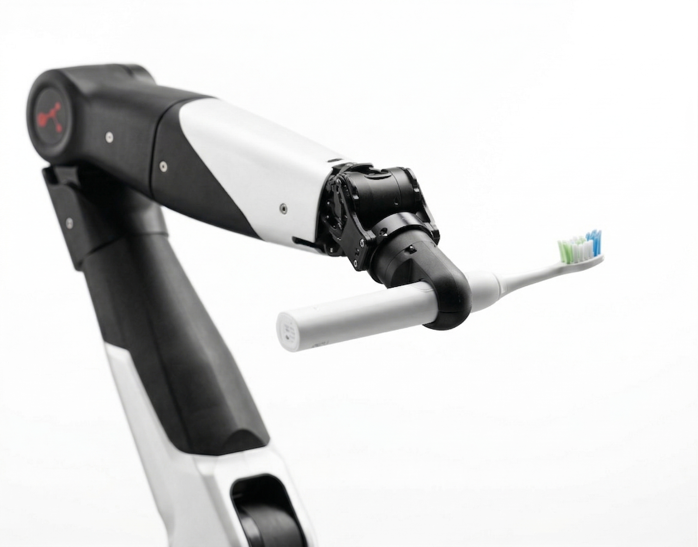
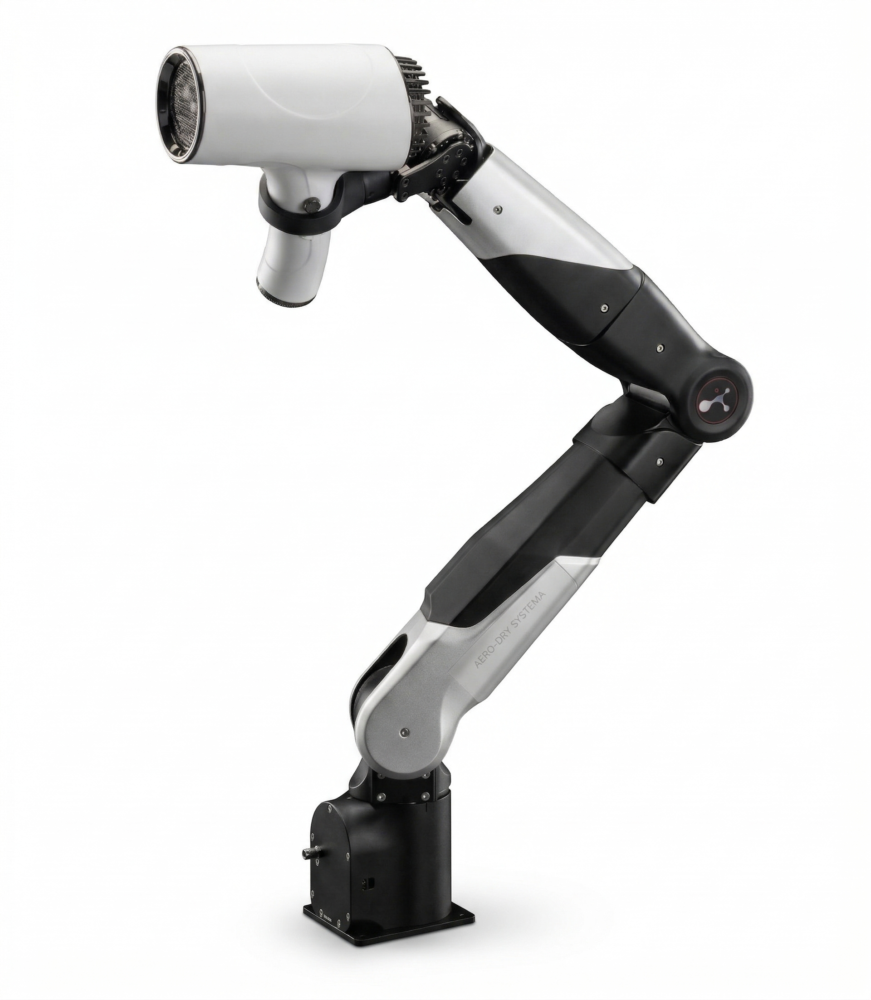
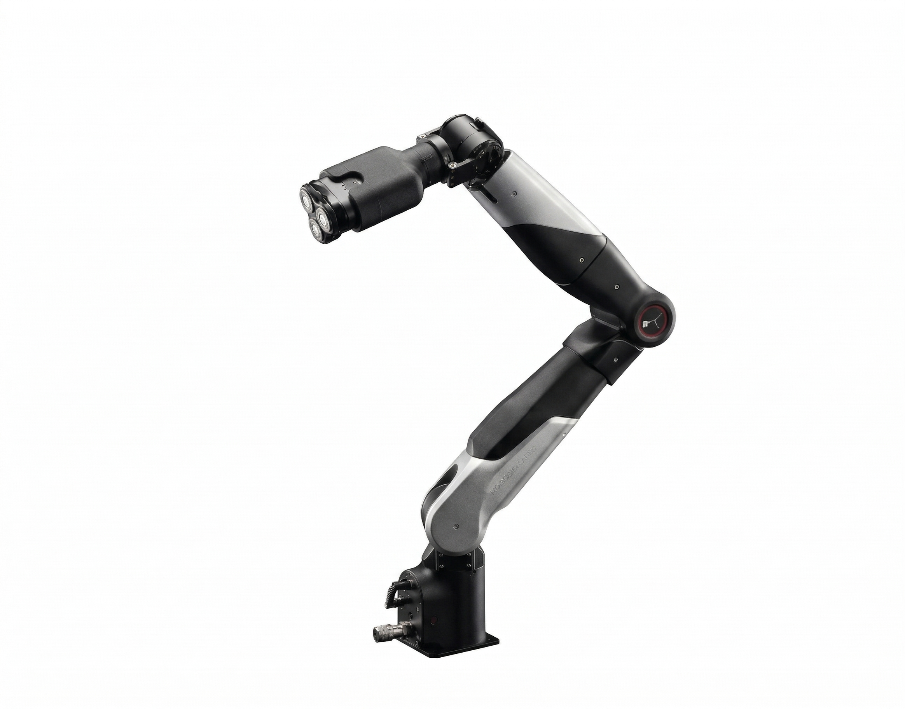
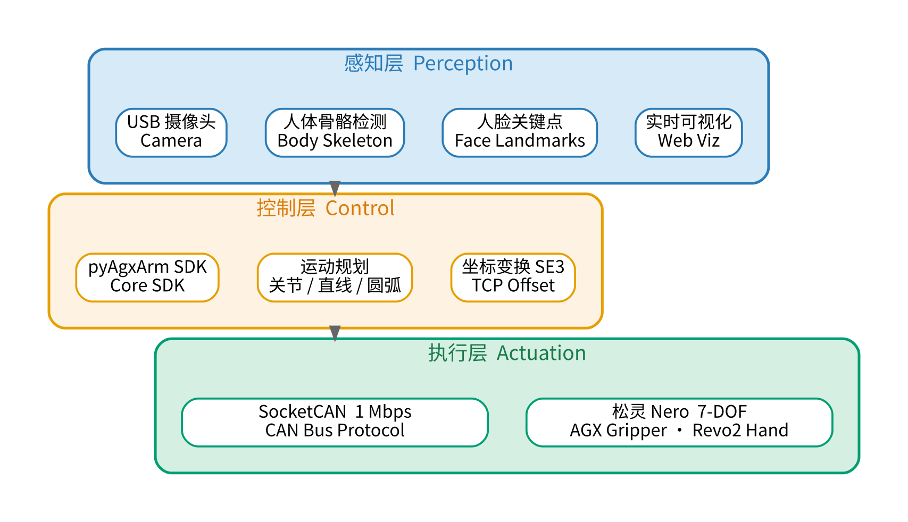
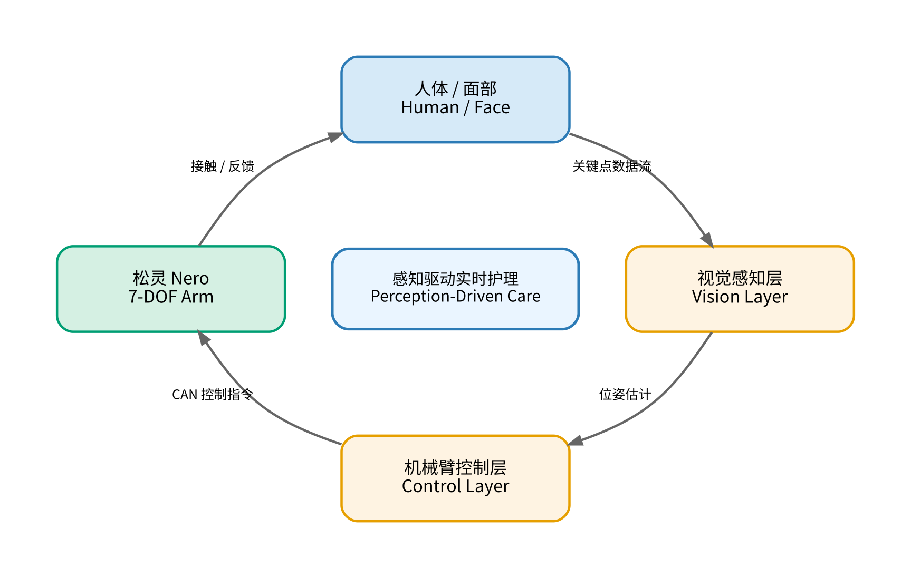
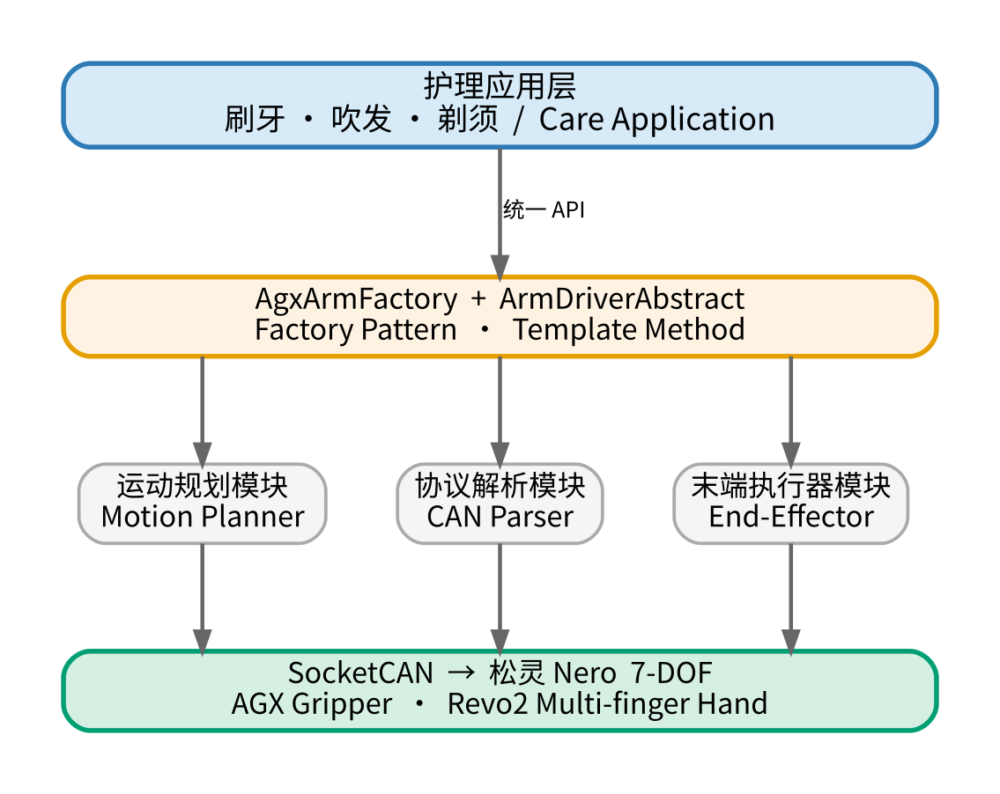

# tri.me

**家务护理具身智能平台**

---

### 项目简介

**tri.me**（发音同 *Treat Me*）是一个面向家庭日常护理场景的具身智能开发框架。

我们相信，机器人进入家庭的第一步，不是做饭或搬运，而是那些最私人、最细腻的护理动作。tri.me 以松灵 Nero 七自由度机械臂为硬件基础，结合实时视觉感知，让机器人完成刷牙、吹头发、剃胡子三类核心护理任务。

---

### 应用场景

<table>
<tr>
<td align="center" width="33%">
<br/><br/>
<b>🦷 刷牙</b><br/>
牙刷轨迹规划 × 力控清洁
</td>
<td align="center" width="33%">
<br/><br/>
<b>💨 吹头发</b><br/>
头部跟随 × 角度自适应
</td>
<td align="center" width="33%">
<br/><br/>
<b>🪒 剃胡子</b><br/>
面部轮廓贴合 × 微米级精度
</td>
</tr>
</table>

---

### 系统架构

tri.me 采用**三层解耦架构**，感知、控制、执行各自独立，形成完整闭环。

<br/>



**感知层**　实时采集人体状态，驱动机械臂动态响应。包含人体骨骼关键点检测、人脸关键点检测、摄像头接入与硬件加速编解码，以及实时可视化监控。

**控制层**　机械臂 SDK 核心，将护理动作指令转化为运动控制信号。工厂模式管理驱动加载，统一对外接口，支持关节空间、笛卡尔、直线、圆弧等多种运动模式，并内置 SE3 坐标变换与 TCP 偏置管理。

**执行层**　通过 SocketCAN 协议与松灵 Nero 机械臂高速通信，驱动末端执行器完成护理动作。

---

### 感知驱动闭环

机械臂不做固定轨迹回放，而是持续接收视觉层的人体关键点数据，实时调整末端位姿，实现真正"以人为中心"的护理。

<br/>



---

### 模块化驱动架构

工厂模式统一管理驱动加载，模板方法定义控制骨架，上层护理应用无需感知底层硬件差异，各模块可独立升级替换。

<br/>



---

### 硬件平台

**松灵 Nero — 7 自由度协作机械臂**

7 个关节提供冗余自由度，可在复杂护理姿态下灵活避障，兼顾大幅度动作（吹发）与高精度对称运动（剃须）。

末端执行器按任务配置：

- **AGX 夹爪** — 夹持牙刷、剃须刀等细长工具
- **Revo2 多指手** — 握持吹风机等异形工具

---

### 设计理念

**安全优先**　护理场景与人体直接接触，碰撞保护、关节限位、紧急停止均内置于驱动层，所有运动指令经验证后方可下发。

**感知驱动**　实时人体关键点数据驱动末端位姿动态调整，非固定轨迹回放。

**模块解耦**　感知、控制、执行三层完全独立，视觉模型、通信协议均可独立升级替换。

**统一接口**　护理应用层通过统一 API 调用，无需关注底层硬件差异。

---

### 基座模型权重

tri.me 使用 [π0.5](https://huggingface.co/physical-intelligence/pi0.5) 作为策略网络基座。

| 模型 | 链接 | 用途 |
|------|------|------|
| π0.5 | [physical-intelligence/pi0.5](https://huggingface.co/physical-intelligence/pi0.5) | 护理任务策略微调基座 |
| π0   | [physical-intelligence/pi0](https://huggingface.co/physical-intelligence/pi0) | 轻量替代 / 消融实验 |

下载方式：

```bash
# 需要先接受 HuggingFace 上的使用协议
huggingface-cli download physical-intelligence/pi0.5 --local-dir checkpoints/pi0.5
```

---

### 环境配置

#### 系统要求

| 项目 | 要求 |
|------|------|
| OS | Ubuntu 22.04 LTS |
| Python | 3.10 |
| CUDA | 12.1（推理必须；采集可用 CPU） |
| 硬件 | USB-CAN 转换器 + 松灵 Nero 机械臂 |

#### Step 1 — 一键初始化 Python 环境

```bash
# 创建 conda 环境 + 安装 PyTorch / lerobot(pi0) / Rerun / h5py
bash scripts/setup_env.sh

# 激活环境（后续所有命令均在此环境下运行）
conda activate trime
```

`setup_env.sh` 做的事：
- 创建 `trime` conda 环境（Python 3.10）
- 安装 PyTorch 2.3.1（CUDA 12.1）
- 从源码安装 lerobot，含 `pi0` extra（π0/π0.5 推理支持）
- 安装 `rerun-sdk`、`h5py`、`opencv-python`、`huggingface_hub`
- 安装系统级 `can-utils`

#### Step 2 — 激活 CAN 总线（连接机械臂）

```bash
# 需要 root；默认接口 can0，波特率 1Mbps
sudo bash scripts/can_up.sh

# 验证连通性
candump can0 &   # 应能看到 Nero 心跳帧
```

无硬件时用虚拟 CAN 测试：

```bash
sudo ip link add dev vcan0 type vcan && sudo ip link set up vcan0
```

#### Step 3 — 下载基座权重

```bash
# 需要先在 HuggingFace 接受 physical-intelligence 的使用协议
huggingface-cli login   # 输入 HF token

huggingface-cli download physical-intelligence/pi0.5 \
    --local-dir checkpoints/pi0.5
```

> π0 轻量版（消融实验用）：
> ```bash
> huggingface-cli download physical-intelligence/pi0 \
>     --local-dir checkpoints/pi0
> ```

#### Step 4 — 视觉栈（ROS2，可选）

感知层基于 ROS2 Humble，仅在需要实时人体关键点检测时安装：

```bash
# 安装 ROS2 Humble（参考官方文档）
# https://docs.ros.org/en/humble/Installation/Ubuntu-Install-Debs.html

# 编译视觉包
source /opt/ros/humble/setup.bash
colcon build --packages-select \
    hobot_usb_cam hobot_codec \
    mono2d_body_detection face_landmarks_detection \
    hobot_shm websocket \
    --base-paths vision/
```

---

### 快速上手

#### 数据采集（LeRobot + Rerun 可视化）

```bash
conda activate trime

# 采集刷牙任务，episode 0，30Hz，启动 Rerun 实时预览
python scripts/collect_data.py \
    --task brushing \
    --episode 0 \
    --output data/lerobot \
    --rerun
```

数据保存至 `data/lerobot/brushing/episode_0000.hdf5`，
Rerun viewer 实时展示摄像头帧与关节状态曲线。

#### π0.5 推理

```bash
conda activate trime

# 使用本地权重推理（Step 3 已下载）
python scripts/infer_pi05.py \
    --task brushing \
    --checkpoint checkpoints/pi0.5 \
    --device cuda

# 或直接从 HuggingFace Hub 加载（首次自动下载）
python scripts/infer_pi05.py \
    --task brushing \
    --checkpoint physical-intelligence/pi0.5 \
    --device cuda
```

---

### 项目结构

```
tri.me/
├── action_control/          # 机械臂控制 SDK (pyAgxArm)
│   └── base/pyAgxArm/
│       ├── api/             # 工厂接口与驱动配置
│       ├── protocols/       # CAN 协议、消息定义、Nero 驱动
│       ├── utiles/          # 坐标变换 (SE3)、数值编解码
│       └── demos/           # 示例脚本
├── vision/                  # 视觉感知栈（ROS2）
│   ├── hobot_usb_cam/       # 摄像头驱动
│   ├── hobot_codec/         # 硬件编解码
│   ├── mono2d_body_detection/     # 人体骨骼检测
│   ├── face_landmarks_detection/  # 人脸关键点检测
│   ├── hobot_shm/           # 共享内存传输
│   └── websocket/           # 实时 Web 可视化
└── scripts/                 # 数据采集与推理脚本
    ├── setup_env.sh         # 一键环境初始化
    ├── can_up.sh            # 激活 SocketCAN 接口
    ├── collect_data.py      # LeRobot 采集 + Rerun 可视化
    └── infer_pi05.py        # π0.5 推理
```

---

### License

See [LICENSE](LICENSE) for details.
